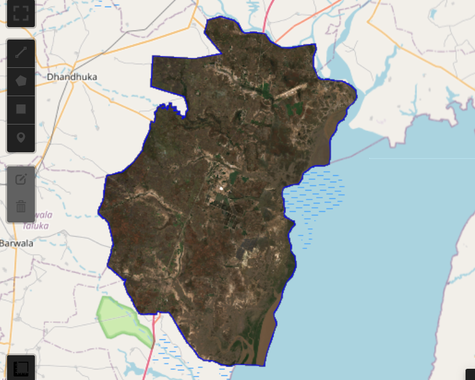
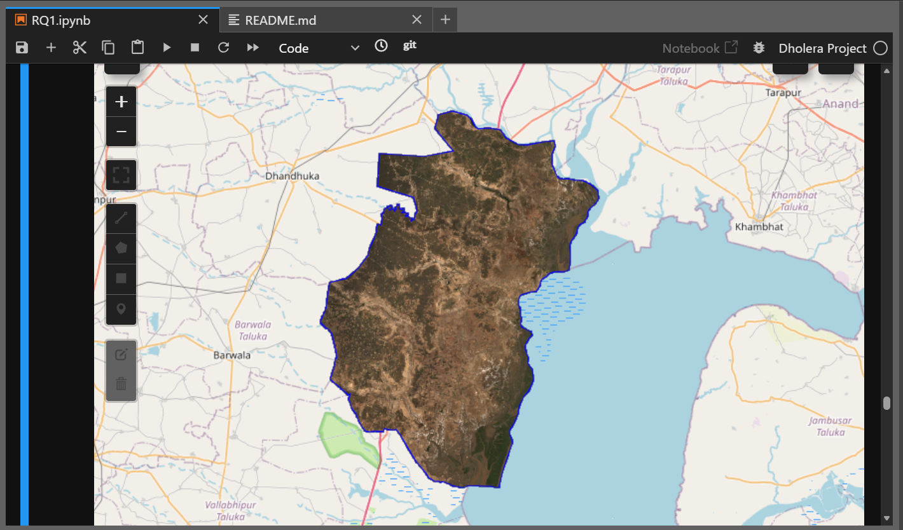
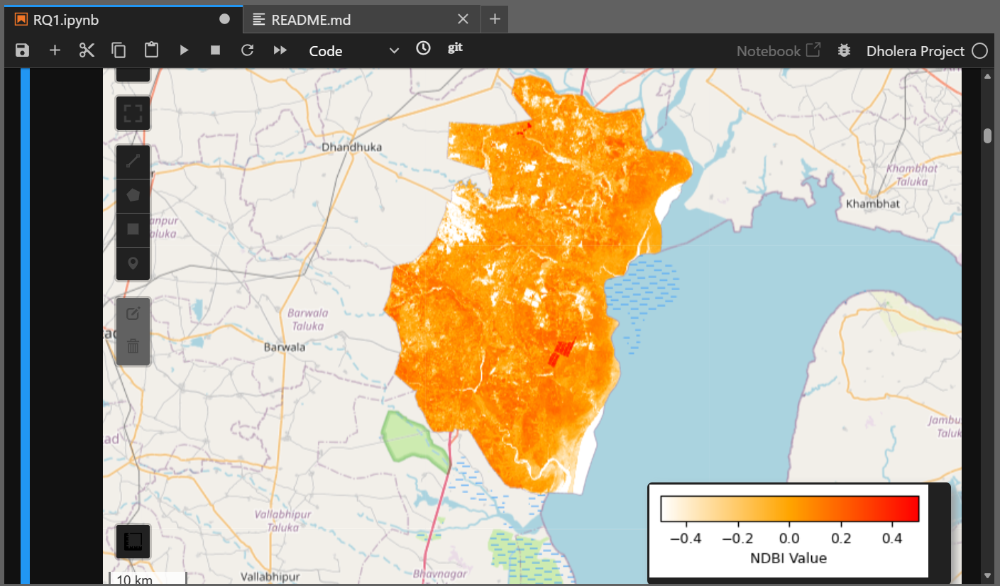
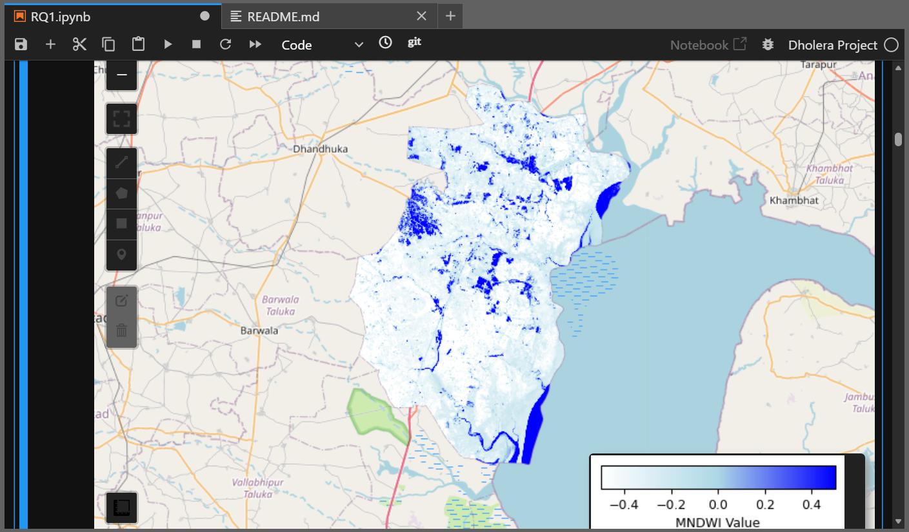
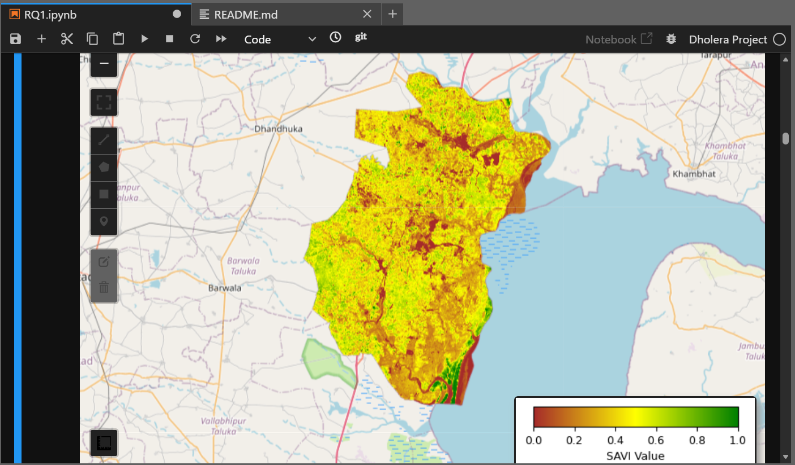
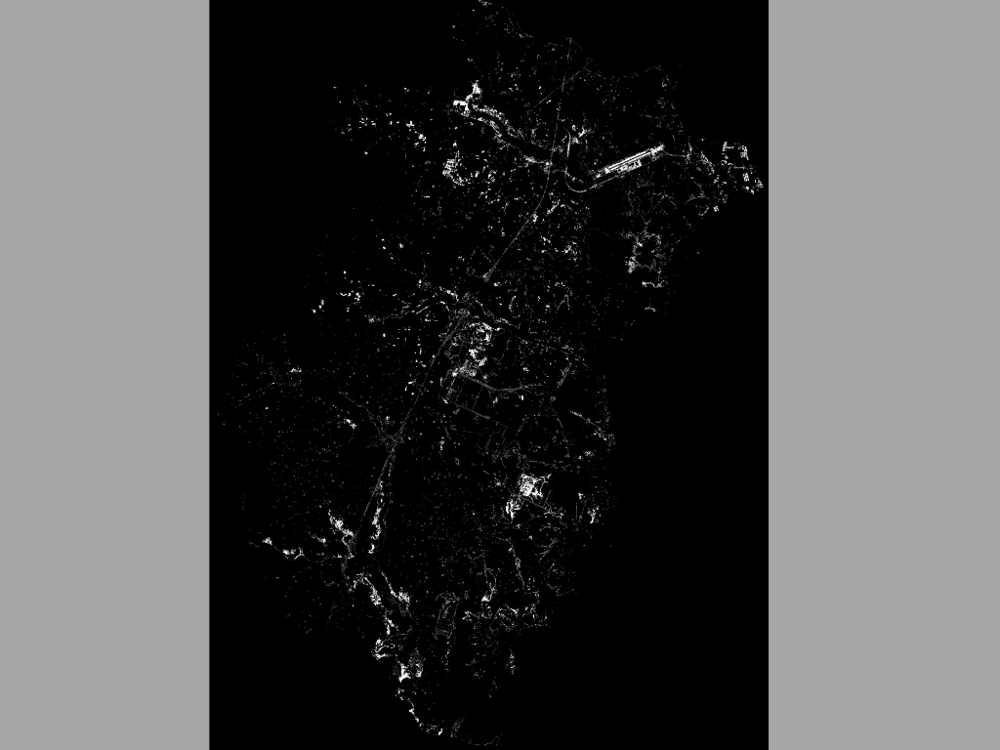
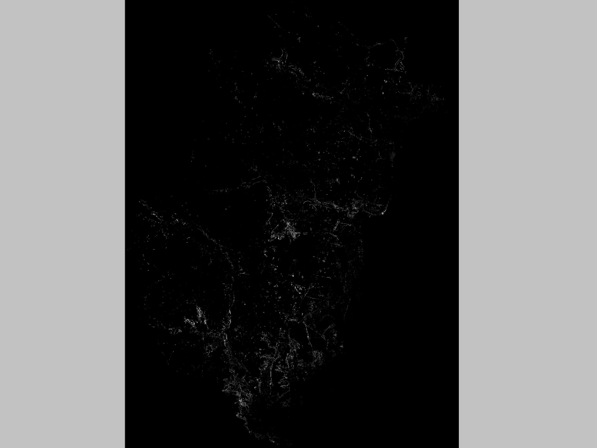
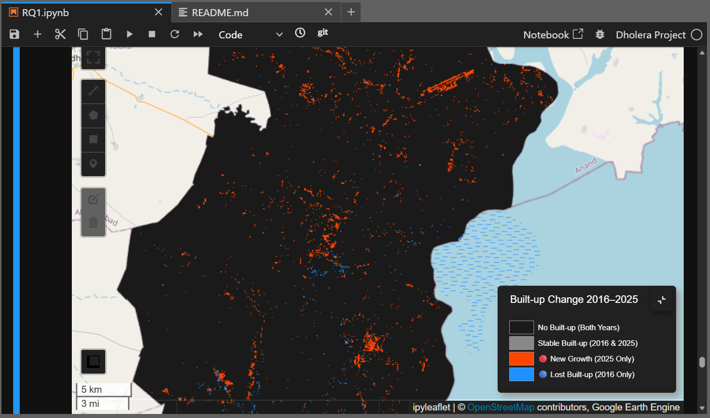
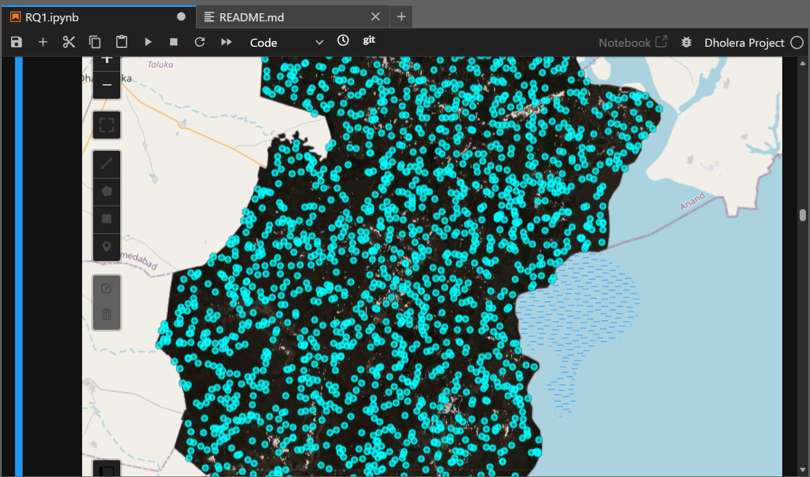
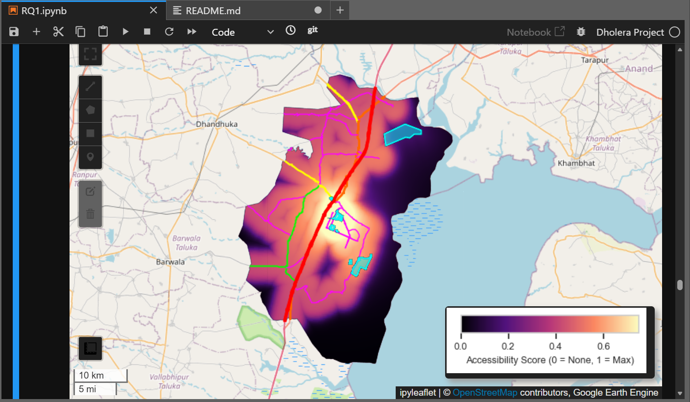

# Industrial Corridor STM
### RQ1 : Built-up Growth & Infrastructure Accessibility: Dholera SIR (2016–2025)

---

## Overview

This study treats urbanization as a **spatially emergent process** driven by infrastructure-induced accessibility - not static land-use mapping.

> **Urban built-up growth is a function of spatial accessibility fields generated by transportation networks and infrastructure nodes.**

**Research Question:** Has infrastructure development in Dholera SIR driven measurable built-up growth, and does proximity to roads and key infrastructure nodes explain the spatial pattern of urbanization?

| Hypothesis | Statement |
|---|---|
| H1 | Built-up density decreases with distance from major roads |
| H2 | Infrastructure nodes create secondary density clusters independent of road proximity |
| H3 | A composite accessibility surface better explains growth than road distance alone |

---

## Setup

```bash
pip install geemap earthengine-api geopandas matplotlib seaborn scikit-learn
```

```python
import geemap
geemap.ee_initialize()   # Requires GEE authentication
```

---

## Data

| File | Path |
|---|---|
| Dholera Taluka boundary | `data/processed/Dholera_Taluk.geojson` |
| Major roads (OSM-extracted) | `data/processed/important_roads.geojson` |
| Active infrastructure nodes | `data/processed/dholera_active_infra.geojson` |
| Pre-sampled points | `data/processed/dholera_points_2025.csv` |

> Roads filtered from OSM via QGIS: `motorway|trunk|primary|secondary|tertiary`.
> Infrastructure nodes manually delineated by georeferencing Dholera's activation area.

---

## Analytical Pipeline

### Stage 1 - Sentinel-2 True Color Composites

Oct–Dec composites used for both years to minimize SWIR soil reflectance noise from summer/monsoon seasons.

| 2025 | 2016 |
|---|---|
|  |  |

---

### Stage 2 - Spectral Indices

| Index | Formula | Purpose |
|---|---|---|
| NDBI | `(SWIR1 − NIR) / (SWIR1 + NIR)` | Detect built-up surfaces |
| MNDWI | `(Green − SWIR1) / (Green + SWIR1)` | Mask water / salt pans |
| SAVI | `((NIR − Red) × 1.5) / (NIR + Red + 0.5)` | Mask vegetation |

**NDBI 2025** - Red/orange = built-up surfaces or saline soil noise



**MNDWI 2025** - Deep blue = water bodies / reservoirs



**SAVI 2025** - Vibrant green = healthy vegetation / biomass



---

### Stage 3 - Built-up Masks

White = built-up, Black = everything else.

| Index | 2025 Threshold | 2016 Threshold |
|---|---|---|
| NDBI | > 0.05 | > 0.13 |
| MNDWI | < 0 | < 0 |
| SAVI | < 0.18 | < 0.18 |

> Stricter 2016 NDBI threshold (`0.13`) accounts for lower radiometric contrast in early Sentinel-2 data.

| 2025 | 2016 |
|---|---|
|  |  |

---

### Stage 4 - Growth Heatmap (2016 → 2025)

| Symbol | Class | Meaning |
|---|---|---|
| ⬛ | 0 | No built-up either year |
| ⬜ | 1 | Stable — built-up in both years |
| 🟠 | 2 | New growth (urbanized 2016→2025) |
| 🔵 | 3 | Lost — built-up in 2016 only |



**Area Change Summary:**

| Metric | km² |
|---|---|
| Total Built-up 2016 | 10.537 |
| Total Built-up 2025 | 35.509 |
| Stable Built-up | 1.495 |
| New Growth | 34.013 |
| Lost Built-up | 9.041 |
| **Net Change** | **24.972** |
| **% Change** | **+236.99%** |

---

### Stage 5 - Road Proximity Analysis

2,000 random sample points attributed with distance to nearest road and 250m focal-mean built-up density. A **7.5 km buffer** captures the airport - the study zone's primary infrastructure anchor.



**Regression: Distance vs. Built-up Density**

A 2nd-order polynomial fit captures non-linear density decay with road distance.

.png)

An order-3 polynomial further resolves a **secondary density peak near the airport (~5.5 km)**, which currently lacks direct road connectivity (as of March 2026).

.png)

**Statistical Results:**

| Metric | Value | Interpretation |
|---|---|---|
| Pearson r | −0.0284 | Very weak road-proximity effect |
| R² | 0.0053 | ~0.5% variance explained by road distance alone |

The near-zero correlation reflects roads built **ahead of urbanization** - a characteristic early-stage activation pattern in planned industrial corridors. The secondary peak supports a **dual-anchor model**: primary growth along transport corridors, secondary growth around the airport, independent of road proximity.

---

### Stage 6 - Master Accessibility Surface

Accessibility is modeled as a weighted fusion of:

#### 1. Road Accessibility 
- Modeled using **sigmoid decay**
- Accounts for diminishing influence with distance
- Inflection point at ~3 km reflects practical commuting thresholds

#### 2. Infrastructure Accessibility 
- Modeled using **exponential decay**
- Tier-based influence:
  - Tier 1 (airport, major industrial nodes): σ = 5 km  
  - Tier 2 (power, solar infrastructure): σ = 2 km  

This follows **Weber’s industrial location theory**, where economic activity clusters around infrastructure nodes.



---

## Key Outputs

| Output | Description |
|---|---|
| Built-up masks (2016, 2025) | Binary rasters, exportable as GeoTIFF to Google Drive |
| Growth heatmap | 4-class change raster with legend |
| Area change report | km² stats: stable, new, lost, net, % change |
| Regression plots | Polynomial fit (O2 / O3): road distance vs. built-up density |
| Master accessibility surface | Fused road + infrastructure heatmap raster |

---
## Key Findings

The analysis reveals an **infrastructure-first development pattern**, where spatial accessibility - rather than existing land use — is the primary driver of urbanization in Dholera SIR.

---

### 1. Rapid Built-up Expansion

Dholera SIR underwent substantial physical transformation over the 9-year study period.

| Metric | Value |
|---|---|
| Built-up area (2016) | 10.537 km² |
| Built-up area (2025) | 35.509 km² |
| Net new growth | 34.013 km² |
| **Total expansion** | **+236.99%** |

This marks a clear shift from a predominantly rural and saline landscape to an emerging industrial footprint.

---

### 2. The "Roads Ahead of Growth" Paradox

A central finding is the statistical decoupling of road proximity from built-up density.

| Metric | Value | Interpretation |
|---|---|---|
| Pearson r | −0.0284 | Very weak road-proximity effect |
| R² | 0.0053 | < 1% of variance explained by road distance |

Road infrastructure in Dholera has been laid ahead of urbanization - across barren and saline land - to activate future development zones, rather than responding to organic growth. This is a defining characteristic of planned industrial corridor development.

---

### 3. Dual-Anchor Development Model

Regression analysis indicates that built-up growth is being shaped by two distinct spatial anchors rather than a single road-based gradient.

- **Primary spine** - Growth concentrated along main transport and industrial corridors
- **Secondary hub** - An order-3 polynomial fit resolved a secondary density peak approximately 5.5 km from the main road network, corresponding to the Dholera International Airport zone

This confirms that major infrastructure nodes generate independent urban density clusters, even in the absence of direct road connectivity.

---

### 4. Composite Accessibility Explains Growth Better

Modeling accessibility as a weighted fusion of sigmoid road decay and exponential infrastructure decay - distinguishing Tier 1 nodes (airport, industrial zones) from Tier 2 nodes (solar, power infrastructure) - captures the spatial pattern of growth more accurately than road distance alone. This supports the use of multi-source accessibility surfaces for planning and impact assessment in corridor cities.

---

## Limitations

- Classification uses **threshold-based spectral indices** - no formal ground-truth validation performed
- **Two temporal snapshots** only (2016, 2025); no continuous change detection
- Correlation ≠ causation - policy, land markets, and speculation likely co-drive growth

---

> All analysis code is contained in the `RQ1` notebook.