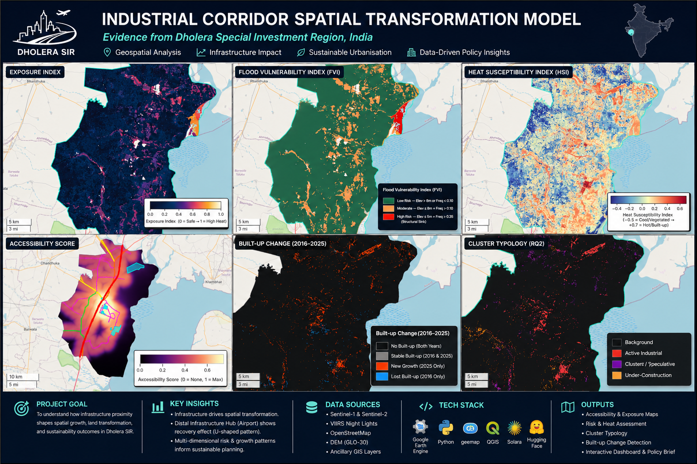
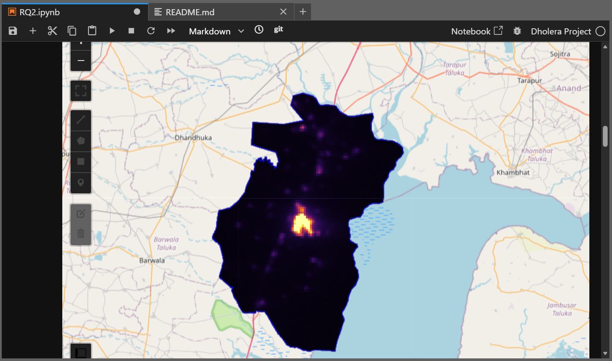
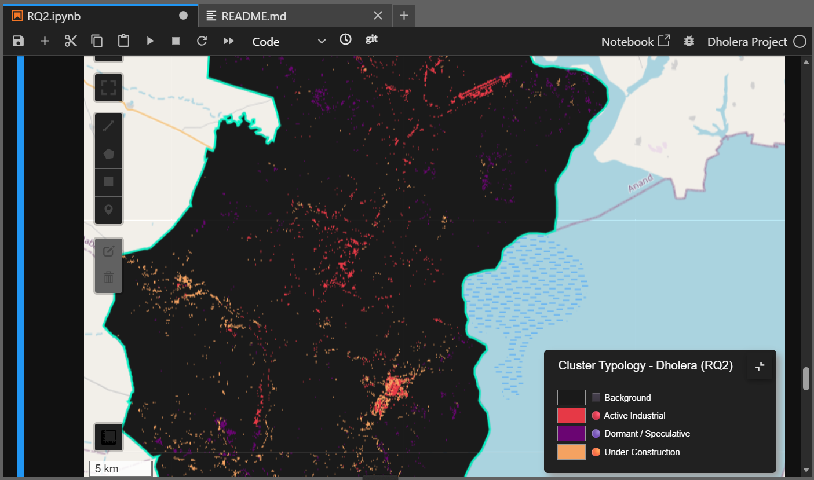
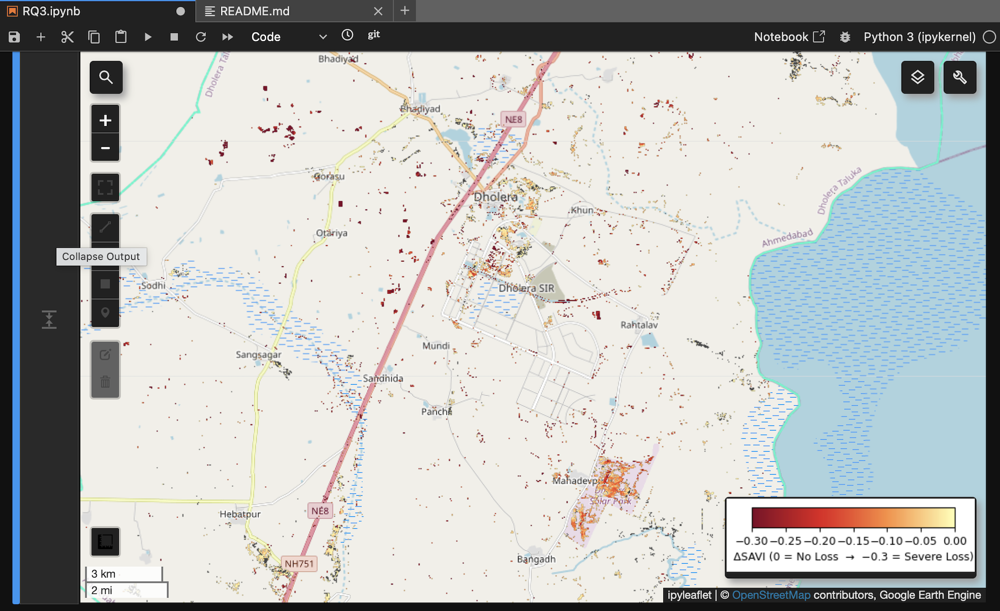
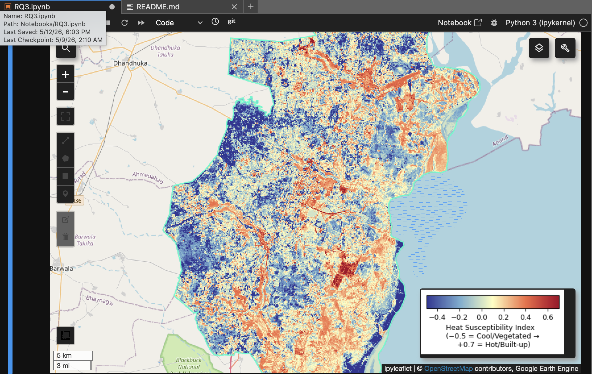
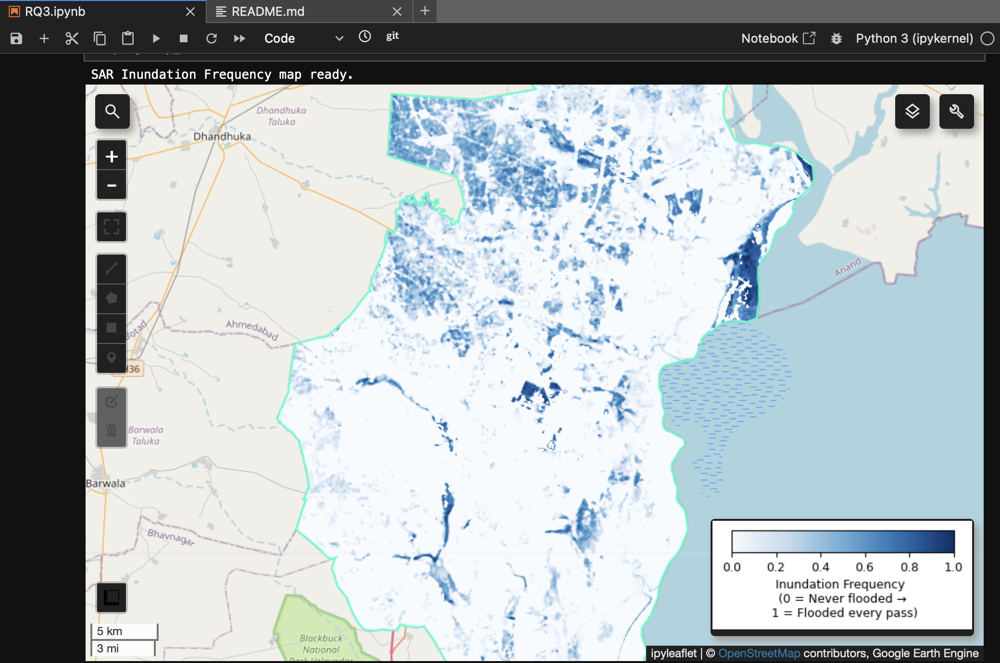
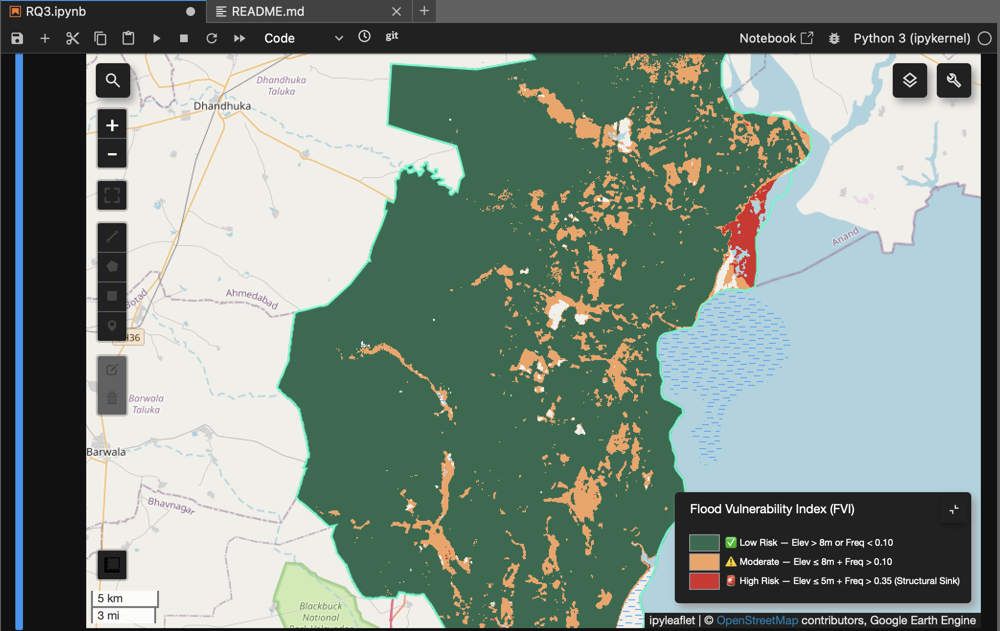
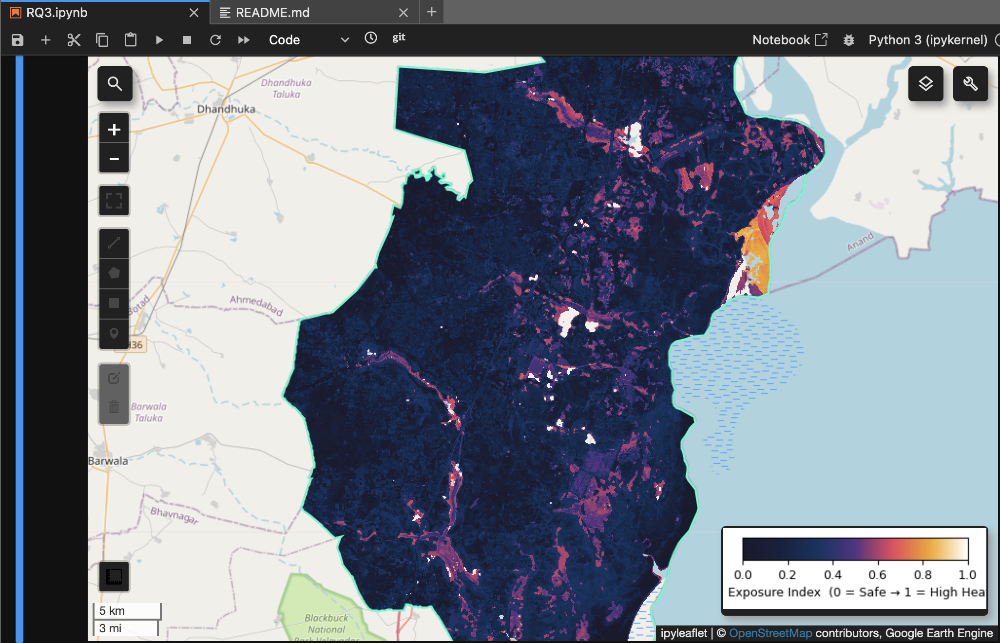

# Industrial Corridor STM

---

---
### RQ1 : Built-up Growth & Infrastructure Accessibility: Dholera (2016–2025)
---

## Overview

This study treats urbanization as a **spatially emergent process** driven by infrastructure-induced accessibility - not static land-use mapping.

> **Urban built-up growth is a function of spatial accessibility fields generated by transportation networks and infrastructure nodes.**

**Research Question:** Has infrastructure development in Dholera SIR driven measurable built-up growth, and does proximity to roads and key infrastructure nodes explain the spatial pattern of urbanization?

| Hypothesis | Statement |
|---|---|
| H1 | Built-up density decreases with distance from major roads |
| H2 | Infrastructure nodes create secondary density clusters independent of road proximity |
| H3 | A composite accessibility surface better explains growth than road distance alone |

---

## Setup

```bash
pip install geemap earthengine-api geopandas matplotlib seaborn scikit-learn
```

```python
import geemap
geemap.ee_initialize()   # Requires GEE authentication
```

---

## Data

| File | Path |
|---|---|
| Dholera Taluka boundary | `data/processed/Dholera_Taluk.geojson` |
| Major roads (OSM-extracted) | `data/processed/important_roads.geojson` |
| Active infrastructure nodes | `data/processed/dholera_active_infra.geojson` |
| Pre-sampled points | `data/processed/dholera_points_2025.csv` |

> Roads filtered from OSM via QGIS: `motorway|trunk|primary|secondary|tertiary`.
> Infrastructure nodes manually delineated by georeferencing Dholera's activation area.

---

## Analytical Pipeline

### Stage 1 - Sentinel-2 True Color Composites

Oct–Dec composites used for both years to minimize SWIR soil reflectance noise from summer/monsoon seasons.

| 2025 | 2016 |
|---|---|
|  |  |

---

### Stage 2 - Spectral Indices

| Index | Formula | Purpose |
|---|---|---|
| NDBI | `(SWIR1 − NIR) / (SWIR1 + NIR)` | Detect built-up surfaces |
| MNDWI | `(Green − SWIR1) / (Green + SWIR1)` | Mask water / salt pans |
| SAVI | `((NIR − Red) × 1.5) / (NIR + Red + 0.5)` | Mask vegetation |

**NDBI 2025** - Red/orange = built-up surfaces or saline soil noise


**MNDWI 2025** - Deep blue = water bodies / reservoirs


**SAVI 2025** - Vibrant green = healthy vegetation / biomass


---

### Stage 3 - Built-up Masks

White = built-up, Black = everything else.

| Index | 2025 Threshold | 2016 Threshold |
|---|---|---|
| NDBI | > 0.05 | > 0.13 |
| MNDWI | < 0 | < 0 |
| SAVI | < 0.18 | < 0.18 |

> Stricter 2016 NDBI threshold (`0.13`) accounts for lower radiometric contrast in early Sentinel-2 data.

| 2025 | 2016 |
|---|---|
|  |  |

---

### Stage 4 - Growth Heatmap (2016 → 2025)

| Symbol | Class | Meaning |
|---|---|---|
| ⬛ | 0 | No built-up either year |
| ⬜ | 1 | Stable — built-up in both years |
| 🟠 | 2 | New growth (urbanized 2016→2025) |
| 🔵 | 3 | Lost — built-up in 2016 only |


**Area Change Summary:**

| Metric | km² |
|---|---|
| Total Built-up 2016 | 10.537 |
| Total Built-up 2025 | 35.509 |
| Stable Built-up | 1.495 |
| New Growth | 34.013 |
| Lost Built-up | 9.041 |
| **Net Change** | **24.972** |
| **% Change** | **+236.99%** |

---

### Stage 5 - Road Proximity Analysis

2,000 random sample points attributed with distance to nearest road and 250m focal-mean built-up density. A **7.5 km buffer** captures the airport - the study zone's primary infrastructure anchor.


**Regression: Distance vs. Built-up Density**

A 2nd-order polynomial fit captures non-linear density decay with road distance.

.png)

An order-3 polynomial further resolves a **secondary density peak near the airport (~5.5 km)**, which currently lacks direct road connectivity (as of March 2026).

.png)

**Statistical Results:**

| Metric | Value | Interpretation |
|---|---|---|
| Pearson r | −0.0284 | Very weak road-proximity effect |
| R² | 0.0053 | ~0.5% variance explained by road distance alone |

The near-zero correlation reflects roads built **ahead of urbanization** - a characteristic early-stage activation pattern in planned industrial corridors. The secondary peak supports a **dual-anchor model**: primary growth along transport corridors, secondary growth around the airport, independent of road proximity.

---

### Stage 6 - Master Accessibility Surface

Accessibility is modeled as a weighted fusion of:

#### 1. Road Accessibility 
- Modeled using **sigmoid decay**
- Accounts for diminishing influence with distance
- Inflection point at ~3 km reflects practical commuting thresholds

#### 2. Infrastructure Accessibility 
- Modeled using **exponential decay**
- Tier-based influence:
  - Tier 1 (airport, major industrial nodes): σ = 5 km  
  - Tier 2 (power, solar infrastructure): σ = 2 km  

This follows **Weber’s industrial location theory**, where economic activity clusters around infrastructure nodes.


---

## Key Outputs

| Output | Description |
|---|---|
| Built-up masks (2016, 2025) | Binary rasters, exportable as GeoTIFF to Google Drive |
| Growth heatmap | 4-class change raster with legend |
| Area change report | km² stats: stable, new, lost, net, % change |
| Regression plots | Polynomial fit (O2 / O3): road distance vs. built-up density |
| Master accessibility surface | Fused road + infrastructure heatmap raster |

---
## Key Findings

The analysis reveals an **infrastructure-first development pattern**, where spatial accessibility - rather than existing land use - is the primary driver of urbanization in Dholera SIR.

---

### 1. Rapid Built-up Expansion

Dholera SIR underwent substantial physical transformation over the 9-year study period.

| Metric | Value |
|---|---|
| Built-up area (2016) | 10.537 km² |
| Built-up area (2025) | 35.509 km² |
| Net new growth | 34.013 km² |
| **Total expansion** | **+236.99%** |

This marks a clear shift from a predominantly rural and saline landscape to an emerging industrial footprint.

---

### 2. The "Roads Ahead of Growth" Paradox

A central finding is the statistical decoupling of road proximity from built-up density.

| Metric | Value | Interpretation |
|---|---|---|
| Pearson r | −0.0284 | Very weak road-proximity effect |
| R² | 0.0053 | < 1% of variance explained by road distance |

Road infrastructure in Dholera has been laid ahead of urbanization - across barren and saline land - to activate future development zones, rather than responding to organic growth. This is a defining characteristic of planned industrial corridor development.

---

### 3. Dual-Anchor Development Model

Regression analysis indicates that built-up growth is being shaped by two distinct spatial anchors rather than a single road-based gradient.

- **Primary spine** - Growth concentrated along main transport and industrial corridors
- **Secondary hub** - An order-3 polynomial fit resolved a secondary density peak approximately 5.5 km from the main road network, corresponding to the Dholera International Airport zone

This confirms that major infrastructure nodes generate independent urban density clusters, even in the absence of direct road connectivity.

---

### 4. Composite Accessibility Explains Growth Better

Modeling accessibility as a weighted fusion of sigmoid road decay and exponential infrastructure decay - distinguishing Tier 1 nodes (airport, industrial zones) from Tier 2 nodes (solar, power infrastructure) - captures the spatial pattern of growth more accurately than road distance alone. This supports the use of multi-source accessibility surfaces for planning and impact assessment in corridor cities.

---

## Limitations

- Classification uses **threshold-based spectral indices** - no formal ground-truth validation performed
- **Two temporal snapshots** only (2016, 2025); no continuous change detection
- Correlation ≠ causation - policy, land markets, and speculation likely co-drive growth

---

> All analysis code is contained in the `RQ1` notebook.

---

# RQ2 : Industrial Cluster Typology & Economic Utilisation: Dholera SIR (2025)

---

## Overview

This study moves beyond physical footprint mapping to interrogate the **economic activation** of built-up land - distinguishing genuinely productive industrial zones from speculative or transitional ones.

> **Built-up area alone is not evidence of economic activity; the spatial distribution of nighttime luminosity within the built-up envelope reveals actual utilisation.**

**Research Question:** What proportion of Dholera's built-up footprint is economically active, and how is industrial utilisation spatially distributed across the corridor?

| Hypothesis | Statement |
|---|---|
| H1 | A significant share of built-up land shows no nighttime luminosity, indicating dormant or speculative occupation |
| H2 | Soil-disturbance signatures mark a transitional pipeline between raw land and operational use |

---

## Data

| Source | Variable | Period |
|---|---|---|
| Sentinel-2 SR Harmonized | Spectral indices (NDBI, MNDWI, SAVI) | Oct–Dec 2025 |
| NOAA VIIRS DNB Monthly V1 | Nighttime radiance (`avg_rad`) | Oct 2025–Mar 2026 |
| Dholera Taluka boundary | ROI geometry | — |

> VIIRS composite uses a median reducer over 6 months to suppress cloud and ephemeral noise. Luminosity threshold set at **0.6 nW/cm²/sr** - calibrated to Dholera's near-zero background radiance - to capture dim industrial signatures (e.g., airport aprons).

---

## Analytical Pipeline

### Stage 1 - VIIRS Nighttime Lights

The Suomi NPP satellite captures radiance at ~1:30 AM local time, providing a direct proxy for economic activity independent of daytime spectral ambiguity.



> Colour ramp: black (no activity) → yellow (high radiance). The inferno palette (0–20 nW/cm²/sr) is used for perceptual uniformity.

---

### Stage 2 - Built-up Mask (Reused from RQ1)

The 2025 built-up mask (NDBI > 0.05, MNDWI < 0, SAVI < 0.18) from RQ1 serves as the spatial base layer. All typology classification is applied exclusively within this confirmed built-up envelope.

---

### Stage 3 - Cluster Typology Classification

Each built-up pixel is assigned one of four classes by layering nighttime luminosity and soil-disturbance conditions onto the base mask:

| Symbol | Class | Classification Logic |
|---|---|---|
| ⬛ | Background | No built-up detected |
| 🔴 | Active Industrial | `built_up = 1` AND `VIIRS > 0.6` |
| 🟣 | Dormant / Speculative | `built_up = 1` AND `VIIRS ≤ 0.6` |
| 🟠 | Under-Construction | `0.18 < SAVI < 0.3` AND `NDBI > 0.05` AND `MNDWI < −0.4` |

> The under-construction class is an additive layer over the built-up mask, capturing soil-disturbance signatures characteristic of active earthworks - **not** mature vegetation or saline background.



---

### Stage 4 - Area Statistics & Industrial Utilisation Ratio (IUR)

Area computed at 10 m native Sentinel-2 resolution using `ee.Image.pixelArea()` grouped by cluster class.

| Class | Area (km²) | Share (%) |
|---|---|---|
| 🔴 Active Industrial | 18.836 | 35.2 |
| 🟣 Dormant / Speculative | 16.673 | 31.1 |
| 🟠 Under-Construction | 18.053 | 33.7 |
| **Total Built-up** | **53.562** | **100.0** |

**Industrial Utilisation Ratio (IUR):**

$$\text{IUR} = \frac{\text{Active Industrial Area}}{\text{Total Built-up Area}} \times 100 = \mathbf{35.2\%}$$

---

## Key Findings

### 1. Decoupling of Physical and Economic Growth

While Dholera expanded its built-up footprint by **+236.99%** over the study period, an IUR of **35.2%** confirms that physical infrastructure has far outpaced economic activation. The majority of paved, developed land shows no measurable nighttime radiance.

### 2. Infrastructure as a Market Signal - Anticipatory Speculative Land Activation

The **31.1% Dormant** share is not evidence of failure - it is evidence of intent. Roads in Dholera are not constructed to serve existing factories; they are deployed to **activate land value for future investors**.

### 3. The "Ghost Grid" Phenomenon

The spatial concentration of dark (low night light) plots, particularly around infrastructure anchors such as the Airport Hub and the concentration of paved plots around Solar Plant shows empirical evidence of **Land Expectation Behavior**: parcels prepared and held in anticipation of economic activation rather than immediate use.

### 4. A Pipeline of Transition

The **33.7% Under-Construction** segment reveals that Dholera's speculative pipeline is nearly as large as its active footprint. The corridor is in a state of hyper-transformation, where transitional land - disturbed but not yet operational - rivals productive land in spatial extent.

---

## Limitations

- VIIRS resolution (~500 m) may conflate dim industrial activity with true darkness in low-density zones
- Nighttime radiance is a proxy for economic activity, not a direct measure of output or employment
- Under-construction classification relies on SAVI disturbance thresholds - subject to seasonal soil moisture variation

---

> All analysis code is contained in the `RQ2` notebook.

# RQ3 : Sustainability & Spatial Misalignment: Dholera SIR (2025)

---

## Overview

This study shifts from measuring *what* has been built (RQ1) and *how much of it is active* (RQ2) to interrogating **where** it has been built - and at what ecological cost.

> **Physical infrastructure deployment ahead of urbanisation is not ecologically neutral; the spatial pattern of new built-up growth encodes measurable environmental trade-offs in vegetation loss, heat susceptibility, and flood exposure.**

**Research Question:** Does the spatial footprint of Dholera's built-up expansion overlap with environmentally sensitive or climatically vulnerable terrain, and does corridor development carry a quantifiable ecological cost?

| Hypothesis | Statement |
|---|---|
| H1 | Built-up expansion is associated with declining vegetation cover and increased surface heat susceptibility |
| H2 | A share of new built-up areas overlaps with environmentally sensitive or water-prone zones |

---

## Setup

```bash
pip install geemap earthengine-api geopandas matplotlib
```

```python
import geemap
geemap.ee_initialize()   # Requires GEE authentication
```

---

## Data

| Source | Variable | Period |
|---|---|---|
| Sentinel-2 SR Harmonized | NDBI, MNDWI, SAVI, NDVI | Oct-Dec 2016 & 2025 |
| Sentinel-1 GRD (IW, VV, Descending) | SAR backscatter for inundation mapping | Jun-Oct 2025 (monsoon), Mar-May 2025 (dry baseline) |
| Copernicus GLO-30 DEM | Elevation (m above sea level) | - |
| Dholera Taluka boundary | ROI geometry | - |

> SAR is used instead of Sentinel-2 MNDWI for flood detection because cloud cover over Dholera during monsoon season routinely exceeds 50%, making optical sensors unreliable.

---

## Analytical Pipeline

### Stage 1 - Built-up Masks & Vegetation Change (Reused from RQ1)

Oct-Dec composites for both years.

**SAVI Delta (2025 - 2016):**

SAVI delta is computed as a change layer across the full taluka. A key observational note: net SAVI across the entire ROI is *higher* in 2025 than 2016, attributable to stronger monsoon rainfall in 2025 rather than genuine greening. For this reason, vegetation loss analysis is deliberately constrained to the **new growth footprint only**, pixels classified as Class 2 (new built-up, 2016-2025) - where the anthropogenic signal dominates the monsoon-driven noise.

---

### OUTPUT 1 - Land Transformation Map

Isolates pixels that **simultaneously urbanised and lost vegetation** between 2016 and 2025.

**Logic:**

```
Vegetation Loss in Growth = (GrowthClass == 2) AND (SAVI_Delta < 0)
```

The map layers the SAVI decline gradient (pale yellow = marginal loss → deep red = severe loss) over the full 34 km² new growth footprint (charcoal base), revealing the spatial distribution and intensity of biomass conversion.



**Key Statistics - H1 Test:**

| Metric | Value |
|---|---|
| New Built-up Growth (2016→2025) | 34.013 km² |
| Growth ∩ Vegetation Loss Area | *28.203* km² |
| Share of new growth at cost of local biomass | *82.9* % |
| Avg SAVI Loss per km² of new growth | *-0.1927* |

> Each km² of new industrial footprint carries a measurable average SAVI decline - the ecological price tag of corridor expansion.

---

### OUTPUT 2 - Heat Susceptibility Map

A **composite spectral index** - not a direct LST measurement - that proxies urban heat stress using the balance between built-up surface signal and vegetation buffer:

```
Heat_Index = NDBI_norm - SAVI_norm
```

Both indices are min-max normalised to 0-1 before differencing:
- `NDBI_norm`: anchored to `[-0.5, +0.5]` → mapped to `[0, 1]`
- `SAVI_norm`: anchored to `[0, 0.8]` → mapped to `[0, 1]`

Output values range `[-1, +1]`:
- **Positive** = high heat susceptibility (built-up dominates, no vegetation buffer)
- **Negative** = low heat susceptibility (vegetated, evapotranspiration active)

The map uses a diverging palette: cool blue (vegetated/resilient) → neutral white → fiery red (built-up/heat-exposed).



---

### OUTPUT 3 - Flood Risk Overlay (Bivariate FVI)

#### Why SAR?

Sentinel-2 MNDWI is unusable during peak monsoon - cloud cover over Dholera during June-September routinely exceeds 50%. Sentinel-1 C-band SAR penetrates cloud cover completely; open water returns near-zero backscatter, making the land/water contrast unambiguous.

#### SAR Pipeline (per image)

1. **Load** - IW mode, VV polarisation, descending orbit
2. **Speckle filter** - focal mean, 3×3 kernel, applied *before* thresholding
3. **Threshold** - VV < -17 dB → binary water mask
4. **Permanent water exclusion** - dry-season baseline (Mar-May 2025) used to suppress perennial features (salt pans, reservoirs) from the monsoon flood signal

#### Inundation Frequency Surface

```
Flood_Freq = mean(binary water mask across all monsoon S1 passes)
```

Each pixel value represents the proportion of SAR overpasses showing a water signature, after permanent water exclusion.

| Frequency Range | Interpretation |
|---|---|
| > 0.60 | Semi-permanent inundation (natural depression / channel) |
| 0.35-0.60 | Recurring monsoon flooding (structural sink) |
| 0.10-0.35 | Episodic flooding (peak rain events) |
| 0.05-0.10 | Flash inundation (drains within days) |
| < 0.05 | Effectively non-flooded during monsoon 2025 |

 

#### Flood Vulnerability Index (FVI) - Classification Rules

| Class | Symbol | Criteria | Interpretation |
|---|---|---|---|
| 1 | ✅ Low | Everything else | Topographically resilient or low radar water signature |
| 2 | ⚠️ Moderate | `Elevation ≤ 8m` AND `Freq > 0.10` | Conditionally flood-prone |
| 3 | 🚨 High | `Elevation ≤ 5m` AND `Freq > 0.35` | Structural sink - floods every monsoon |

> Priority order: Low (base) → Moderate overwrites → High overwrites. Permanent water pixels are masked out of the final FVI entirely - they are not flood risk zones.



**Area Statistics - H2 Test:**

| FVI Class | Area (km²) | Share of ROI (%) |
|---|---|---|
| ✅ Low Risk | *983.651* | 84.9 |
| ⚠️ Moderate Risk | *164.324* | 14.2 |
| 🚨 High Risk | *10.672* | 0.9 |

| H2 Metric | Value |
|---|---|
| New Growth in Moderate Risk Zone | *8.865* km² (*26.1% of new growth*) |
| New Growth in High Risk Zone | *0.027* km² (*0.1% of new growth*) |
| **Total New Growth in Risk Zones** | ***8.892* km²** |

---

### OUTPUT 4 - Environmental Exposure Layer

A single composite surface fusing both risk dimensions into one normalised index:

```
Env_Exposure = 0.5 × HeatRisk_norm + 0.5 × FloodRisk_norm
```

| Component | Normalisation |
|---|---|
| Heat Risk | `(heat_index + 0.5) / 1.2`, clamped to `[0, 1]` |
| Flood Risk | `(FVI_class - 1) / 2` → Low = 0.0, Moderate = 0.5, High = 1.0 |

Output range: `0` (no environmental exposure) → `1` (maximum combined heat + flood risk). The equal weighting treats heat susceptibility and flood vulnerability as co-equal sustainability concerns.

The new growth footprint overlay on this layer provides a direct visual read of how much of Dholera's infrastructure pipeline sits inside high-exposure terrain.



---

## Key Outputs

| Output | Description |
|---|---|
| Land Transformation Map | SAVI decline gradient within new growth footprint; vegetation loss intensity visualised |
| Vegetation Loss Statistics | Area (km²) and share (%) of new growth that coincided with biomass loss; avg SAVI decline per km² |
| Heat Susceptibility Map | Continuous NDBI_norm − SAVI_norm index across taluka; diverging blue-to-red palette |
| SAR Flood Frequency Surface | Per-pixel monsoon inundation frequency from Sentinel-1; permanent water excluded via dry-season baseline |
| Flood Vulnerability Index (FVI) | 3-class bivariate classification (terrain + SAR); new growth overlap statistics |
| Environmental Exposure Layer | Equal-weighted composite of heat + flood normalised risk; 0–1 continuous surface |

---

## Key Findings

### 1. Vegetation Loss is Concentrated, Not Diffuse

Built-up expansion in Dholera is not uniformly levelling vegetation - the SAVI decline signal is spatially concentrated within specific sectors of the new growth footprint. Constraining the analysis to the new growth mask (rather than the full taluka) corrects for a dataset-level confound: 2025 SAVI is higher than 2016 across the whole ROI due to a stronger monsoon season, which would otherwise mask localised ecological degradation with corridor-wide greening.

### 2. Infrastructure Deployment Carries a Measurable Ecological Price Tag

The average SAVI decline per km² of new industrial footprint quantifies the biomass cost of corridor expansion in a form directly comparable across future study periods or other corridor sites. This is not merely a land-cover statistic - it is an ecological liability metric.

### 3. A Measurable Share of New Growth Occupies Flood-Vulnerable Terrain

The FVI overlay on the new growth footprint confirms H2: a portion of Dholera's infrastructure investment has been placed inside terrain confirmed as flood-prone by SAR inundation evidence - terrain that is low-elevation and repeatedly inundated during monsoon.

### 4. The Dual Exposure Problem

Spatial co-occurrence of heat susceptibility and flood vulnerability - captured in the Environmental Exposure Layer - reveals that some zones face *compound* environmental risk: high built-up density with minimal vegetation buffer, situated on low-lying, repeatedly inundated terrain. This dual exposure pattern is a direct consequence of the infrastructure-first development logic documented in RQ1 and RQ2.

---

## Limitations

- **SAVI delta monsoon issue** - 2025 baseline spectral parameters of SAVI are elevated due to higher regional precipitation anomalies; calculations are tightly isolated to the new growth footprint boundary to mitigate distorted signals.
- **GLO-30 vertical accuracy** - ~4 m absolute vertical error over flat terrain; in an area where FVI thresholds are set at 5 m and 8 m, this introduces classification uncertainty in boundary pixels.
- **SAR thresholding** - The -17 dB water detection threshold is applied uniformly; smooth bare soil and salt pans can produce false water signatures even after permanent water exclusion.
- **Heat index is a spectral proxy** - Not a direct land surface temperature measurement; does not account for albedo variation, emissivity differences, or diurnal timing of Sentinel-2 acquisition.
- **Equal weighting in ENV exposure** - The 50/50 heat/flood composite is analytically practical but not empirically calibrated; different weighting schemes would shift the spatial pattern of high-exposure zones.

---

> All analysis code is contained in the `RQ3` notebook.
